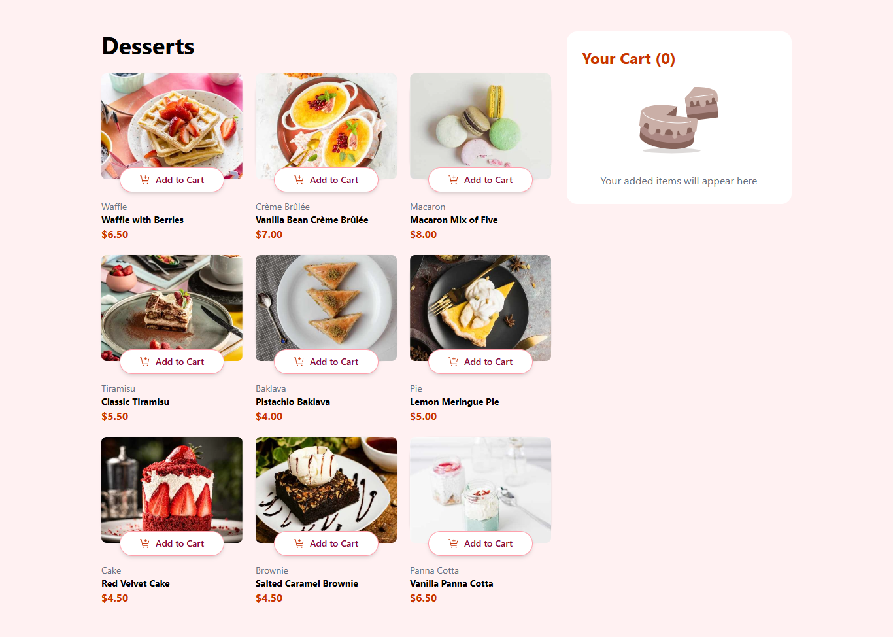

# Frontend Mentor - Product List with Cart Solution

This is my solution to the [Product List with Cart challenge on Frontend Mentor](https://www.frontendmentor.io/challenges/product-list-with-cart-5MmqLVAp_d). This project challenged me to build an interactive and accessible product listing page with cart functionality and responsive design.

## Table of Contents

- [Overview](#overview)
  - [The Challenge](#the-challenge)
  - [Screenshot](#screenshot)
  - [Links](#links)
- [My Process](#my-process)
  - [Built With](#built-with)
  - [What I Learned](#what-i-learned)
  - [Continued Development](#continued-development)
  - [Useful Resources](#useful-resources)
- [Author](#author)
- [Acknowledgments](#acknowledgments)

## Overview

### The Challenge

Users should be able to:

- Add items to the cart and remove them
- Increase/decrease the number of items in the cart
- See an order confirmation modal when they click **"Confirm Order"**
- Reset their selections when they click **"Start New Order"**
- View a responsive layout across devices
- See hover and focus states for all interactive elements

### Screenshot



> Replace with a real screenshot of your application.

### Links

- **Solution URL**: [https://github.com/amikoelvis/Product-List-With-Cart](https://github.com/amikoelvis/Product-List-With-Cart)
- **Live Site URL**: [https://your-live-site-url.com](https://your-live-site-url.com)

## My Process

### Built With

- Semantic HTML5
- Tailwind CSS
- Flexbox and CSS Grid
- React + TypeScript
- Zustand (for state management)
- Mobile-first responsive design

### What I Learned

- Managing global state with Zustand
- Real-time cart updates and total quantity tracking
- Building accessible modals with keyboard/focus support
- UI responsiveness using Tailwind utility classes

Example: Real-time cart quantity logic:

```ts
const totalItems = cartItems.reduce((sum, item) => sum + item.quantity, 0);
```

### Continued development

In the future, I plan to:

- Add persistent cart state with localStorage
- Animate transitions with Framer Motion
- Write unit tests for cart logic and modal behavior
- Improve accessibility and keyboard navigation

### Useful resources

- [Zustand Docs](https://docs.pmnd.rs/zustand/getting-started/introduction) - This helped me master global state using zustand. I really liked this pattern and will use it going forward.
- [Tailwind Docs](https://tailwindcss.com/docs/installation/using-vite) - This is an amazing article which helped me with styling. I'd recommend it to anyone still learning this concept.

## Author

- Website - [Amiko Elvis](https://results-summary-component-plum-one.vercel.app/)
- Frontend Mentor - [@amikoelvis](https://www.frontendmentor.io/profile/amikoelvis)
- Twitter - [@ElvisAmiko](https://www.twitter.com/ElvisAmiko)

## Acknowledgments

Thank you to Frontend Mentor!
